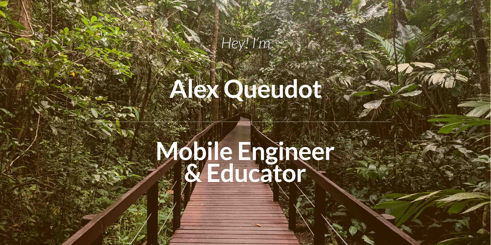

### 🛠 I do
- 📱 **Android** & **iOS** Apps
- 👨‍💻 With a strong focus on Quality, Scalability, Performance & UX
- 👨‍🏫 **Teach** App Development
- ✈️ **Travel** whenever I can
- 💚 And love **Trekking** in the mountains

### ⭐️ Having achieved

| 40 | 1M | 15 | 28 |
| :-: | :-: | :-: | :-: |
| Published Apps | Users Reached | Courses Taught | Countries Visited |

### 💻 Tech Stack
- 🤖 Android [Kotlin]
- 🍎 iOS [Swift]
- 📱 Multiplatform [Flutter]
- ⚙️ Automation [Github Actions CI + Fastlane CD]

### 📱 Latest Projects
<!-- APPSTORES-FEED:START -->

<!-- APPSTORES-FEED:END -->

### 📕 Recent Blog Posts
<!-- BLOG-POST-LIST:START -->
- [Launching Kotlin Coroutines in Android](https://medium.com/l-r-engineering/launching-kotlin-coroutines-in-android-coroutine-scope-context-800d280ebd80?source=rss-18ecf9ef4d5b------2)
- [OAuth2 in Android — Authorization Code Flow](https://medium.com/l-r-engineering/oauth2-in-android-authorization-code-flow-ffc4355dd473?source=rss-18ecf9ef4d5b------2)
- [Migrating Retrofit to Ktor](https://medium.com/l-r-engineering/migrating-retrofit-to-ktor-93bdaf58d7d4?source=rss-18ecf9ef4d5b------2)
<!-- BLOG-POST-LIST:END -->

        <a href="https://medium.com/@alqueraf">View More</a>

### ⚡️ What I've been up to
<!-- INSTAGRAM-FEED:START -->

      

<!-- INSTAGRAM-FEED:END -->

        <a href="https://instagram.com/alqueraf">View More</a>

### 📖 My Recent Reads
<!-- GOODREADS:START -->
- [Anxious People](https://www.goodreads.com/review/show/4314845309?utm_medium=api&utm_source=rss)
- [El enemigo conoce el sistema](https://www.goodreads.com/review/show/4018563201?utm_medium=api&utm_source=rss)
- [The Black Swan: The Impact of the Highly Improbable](https://www.goodreads.com/review/show/3630502845?utm_medium=api&utm_source=rss)
- [El bosc](https://www.goodreads.com/review/show/3897897762?utm_medium=api&utm_source=rss)
- [The Middle Finger Project: Trash Your Imposter Syndrome and Live the Unf*ckwithable Life You Deserve](https://www.goodreads.com/review/show/3546824765?utm_medium=api&utm_source=rss)
<!-- GOODREADS:END -->

        <a href="https://www.goodreads.com/user/show/40277231-alex-queudot">View More</a>

### 🎧 Now Playing

        <a href="https://open.spotify.com/user/alqueraf">View More</a>

   
### 🐦 What I'm tweeting about
<!-- TWITTER:START -->
- [@avalancheavax: Avalanche Summit will take Barcelona by storm at the Poble Espanyol from March 22 to 27, 2022.Register to stay up-to-date with the latest–ticket sales, agenda, speakers, and more!](https://rss.app/articles/cb4e791f6f6d729c074351566bd3a7c508111d6e1e29b3edc3ec8412808771c6fa50b648389c9b2beca36e7ad71c089668d36be8c7117f16833fcd60)
- [@levinriegner: L+R and five of its forward-thinking projects have earned the 2021 w3 Awards in 14 major categories.](https://rss.app/articles/cb4e791f6f6d729c074351566bd3a7c508111d6e133aa4e8ccf08e1f828862d5ad0cb15d2d9d9d77f2a66c75d811089469d469e8c0127e1d823bc2)
- [@avalancheavax: See you in Barcelona!](https://rss.app/articles/cb4e791f6f6d729c074351566bd3a7c508111d6e1e29b3edc3ec8412808771c6fa50b648389c9b2beca36e7bdf12079763dd6de9c0177f138d3dc462)
- [@bibcanfabra: Els #Geeks del #ClubMaker escalfen motors per aquest nou any: tempesta d&#39;idees 🌩️per a la nova temporada🤯Tenim talent de sobra! 🤪I com cada any, ens sorprendran amb els seus ginys! 🧩Anirem informant!🧐 Comencem!💥 #AmericanSpaceBCN](https://rss.app/articles/cb4e791f6f6d729c074351566bd3a7c508111d6e1d36b0e2c3ec811b87946688f10ba4482c9bc169f7a6697cd812069b61d06fe0c7177e178838)
- [@marcvidal: Esta escena distópica y deprimente es auténtica. Uno de los robots de Postmates by Uber rodeando a un vagabundo.Una metáfora de la sociedad futura si no se hace bien. Mientras un robot hace el trabajo por el que antes se les pagaba a los humanos, un vagabundo mira impotente.](https://rss.app/articles/cb4e791f6f6d729c074351566bd3a7c508111d6e123ea0e2d4eb831b89c974d3e30bb04f76d9dd61f4a06b7edd160a9764dd6de6cb127c16)
<!-- TWITTER:END -->

        <a href="https://twitter.com/alqueraf">View More</a>

### 💬 Stay in touch

        
        
        
        
        
        

---
With ❤️ from Barcelona.

*This site is auto-generated with GitHub Actions when new content is available*.

<a href="https://github.com/Alqueraf/Alqueraf">Check the Source Code</a>
