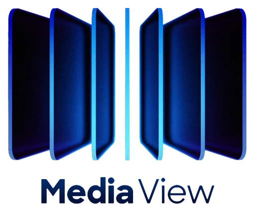

<h1 style="border-bottom: 0; padding-bottom:0px; line-height:0.5">Alex Queudot</h1>

Software Engineer & Educator

### 🛠 I do

- 📱 **Mobile Development**: Crafting scalable and maintainable apps for **Android** and **iOS**.
- 👨‍🏫 **Educator**: Passionate about teaching software engineering.
- ✈️ **Traveler**: Always inspired by new destinations.
- ⛵️ **Sailing Enthusiast**: Catching the wind.

### ⭐️ Having achieved

| 40 | 2M | 15 | 13 | 38 |
| :-: | :-: | :-: | :-: | :-: |
| Published Apps | Users Reached | Courses Taught | Years of Experience | Countries Visited |

### 💻 Favorite Tech

- 🤖 **Android**: Kotlin & Compose
- 🍎 **iOS**: Swift & SwiftUI
- 📱 **Multiplatform**: Flutter
- ⚙️ **CI/CD**: Fastlane + Github Actions

<!-- APPSTORES-FEED:START -->
<!-- APPSTORES-FEED:END -->
<!-- To re-enable: -->
<!-- Uncomment the header -->
<!-- Uncomment the last step on `appstores.workflow.yml` -->

### 📱 Latest Projects

<table>
<tr>
<td style="width:140px; height=140px;">

</td>
<td>
<a href="https://github.com/meta-quest/Meta-Spatial-SDK-Samples/tree/main/Showcases/media_view">MediaView</a> -  
<b>Android</b> Spatial app to view media
</td>
<td>
<a href="https://www.meta.com/">Meta</a> / <a href="https://levinriegner.com/news/media-view">L+R</a>
</td>
<td>
Open Sourced as Best Practices for the new Meta Spatial SDK
</td>
</tr>

<tr>
<td style="width:140px; height=140px;">

</td>
<td>
<a href="https://nidrarls.com">Nidra</a> - <b>iOS</b> HealthTech app for the medical device
</td>
<td>
<a href="https://noctrixhealth.com">Noctrix Health</a>
</td>
<td>
FDA approval and Breakthrough Device Designation
</td>
</tr>

<tr>
<td style="width:140px; height=140px;">

</td>
<td>
<a href="https://www.youtube.com/watch?v=qgOlg173gcI">Global Citizen</a> - <b>Flutter</b> Social app to end extreme poverty
</td>
<td>
<a href="https://www.globalcitizen.org/en/impact">Global Citizen</a> / <a href="https://levinriegner.com/work/global-citizen-take-action">L+R</a>
</td>
<td>
Led 6 Software Engineers to reach 1M+ users taking action
</td>
</tr>

<tr>
<td style="width:140px; height=140px;">

</td>
<td>
<a href="https://entwickler.de">Entwickler</a> -  
<b>Android</b> EdTech platform for Software Engineers
</td>
<td>
<a href="https://sandsmedia.com/de/home">Software & Support Media</a>
</td>
<td>
Taught 100k+ developers in Germany
</td>
</tr>

<tr>
<td style="width:140px; height=140px;">

</td>
<td>
<a href="https://www.youtube.com/shorts/wQXC6u9aSdc">Spireworks</a> -  
<b>iOS</b> IoT app to control New York's skyscrapers
</td>
<td>
<a href="https://www.durst.org">The Durst Organization</a> / <a href="https://levinriegner.com/work/spireworks-app">L+R</a>
</td>
<td>
A city scale real-time interactive art experience
</td>
</tr>
</table>

### 📕 Recent Blog Posts
<!-- BLOG-POST-LIST:START -->
- [Flutter Logging](https://medium.com/l-r-engineering/flutter-logging-4eef9e847fb2?source=rss-18ecf9ef4d5b------2)
- [Craft CMS + AWS Cognito](https://medium.com/l-r-engineering/craft-cms-aws-cognito-f6010924ec23?source=rss-18ecf9ef4d5b------2)
- [Launching Kotlin Coroutines in Android](https://medium.com/l-r-engineering/launching-kotlin-coroutines-in-android-coroutine-scope-context-800d280ebd80?source=rss-18ecf9ef4d5b------2)
- [OAuth2 in Android — Authorization Code Flow](https://medium.com/l-r-engineering/oauth2-in-android-authorization-code-flow-ffc4355dd473?source=rss-18ecf9ef4d5b------2)
- [Migrating Retrofit to Ktor](https://medium.com/l-r-engineering/migrating-retrofit-to-ktor-93bdaf58d7d4?source=rss-18ecf9ef4d5b------2)
<!-- BLOG-POST-LIST:END -->

        <a href="https://alqueraf.medium.com">Visit my blog on Medium</a>

### ⚡️ What I've been up to
<!-- INSTAGRAM-FEED:START -->

      

<!-- INSTAGRAM-FEED:END -->

        <a href="https://instagram.com/alqueraf">Check out my Instagram</a>

### 📖 My Recent Reads
<!-- GOODREADS:START -->
- [Dopamine Nation: Finding Balance in the Age of Indulgence](https://www.goodreads.com/review/show/6740362371?utm_medium=api&utm_source=rss)
- [Tomorrow, and Tomorrow, and Tomorrow](https://www.goodreads.com/review/show/5633230466?utm_medium=api&utm_source=rss)
- [Sea of Tranquility](https://www.goodreads.com/review/show/5488114135?utm_medium=api&utm_source=rss)
- [Dark Matter](https://www.goodreads.com/review/show/5356481756?utm_medium=api&utm_source=rss)
- [The Old Man and the Sea](https://www.goodreads.com/review/show/5246905306?utm_medium=api&utm_source=rss)
<!-- GOODREADS:END -->

        <a href="https://www.goodreads.com/user/show/40277231-alex-queudot">View my library on Goodreads</a>

### 🎧 Now Playing

        <a href="https://open.spotify.com/user/alqueraf">Vibe with me on Spotify</a>

### 👔 LinkedIn Insights
<!-- LINKEDIN:START -->
- [I had the pleasure of speaking at #MetaConnect2024 on a panel with brilliant engineers Michael Borke, Ana Ines Pereyra, and Spen...](https://www.linkedin.com/posts/alexqueudot_metaconnect2024-activity-7246526747700023296--XSH)
- [🚀 L+R and Meta just launched Media View at Meta Connect 2024!   This open-source spatial app allows users to experience all type...](https://www.linkedin.com/posts/l-r_lr-and-meta-release-media-view-an-open-source-activity-7244809698305097728-ASGL)
- [Open call for beta testers! Introducing Askdot by L+R, a fine-tuned AI branded chatbot that L+R is building to answer business s...](https://www.linkedin.com/posts/open-call-for-beta-testers-introducing-askdot-activity-7165406203953545217-9vF7)
<!-- LINKEDIN:END -->

        <a href="https://www.linkedin.com/in/alexqueudot/">Let's connect on LinkedIn</a>

### 🐶 My Furry Copilot

<figure>

<figcaption  style="text-align:center; width: 128px;">Mel Melada</figcaption>
</figure>

### 🐦 What I'm tweeting about
<!-- TWITTER:START -->
- [@TechnovationCat: 📢 Recordatori: Es busquen #TechnovationGirls amb ganes de gaudir de la #tecnologia mentre canviem el món. 🚀 Apunta&#39;t ja, que estem a punt d&#39;enlairar-nos!👉  @ciberespiral #Tecnologia #educació #Girls4Change #TechnovationCAT #TechnovationChallenge](https://twitter.com/TechnovationCat/status/1605533949249331205)
- [@avalancheavax: Avalanche Summit will take Barcelona by storm at the Poble Espanyol from March 22 to 27, 2022.Register to stay up-to-date with the latest–ticket sales, agenda, speakers, and more!](https://twitter.com/avalancheavax/status/1478875863953428483)
- [@levinriegner: L+R and five of its forward-thinking projects have earned the 2021 w3 Awards in 14 major categories.](https://twitter.com/levinriegner/status/1468757791192059907)
<!-- TWITTER:END -->

        <a href="https://x.com/alqueraf">Follow me on Twitter</a>

### 💬 Stay in touch

          
        
        
        
        
        

---
With ❤️ from Barcelona.

*This website self-updates using GitHub Actions when new content is available*.

<a href="https://github.com/Alqueraf/Alqueraf">Check the Source Code</a>

<!-- Monitoring Links -->
<!-- Performance: https://pagespeed.web.dev/ -->
<!-- Analytics: https://analytics.google.com/analytics/web/#/p465778326 -->
<!-- Search: https://search.google.com/search-console -->

<!-- Ideas -->
<!-- GitHub Profile RSS: https://github.com/Alqueraf.atom -->

<!-- Local development -->
<!-- bundle install -->
<!-- bundle exec jekyll serve -->